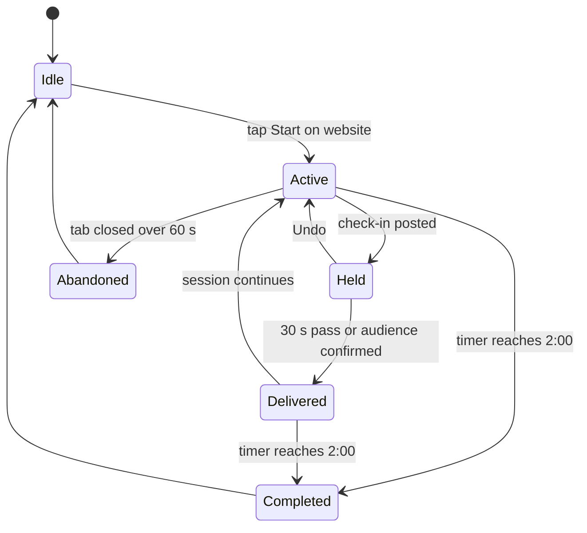
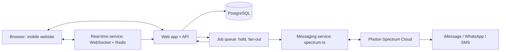

# Toothbrush Connect — Product Requirements Document

Sep 26, 2026 · @Sahmey

## Summary

Toothbrush Connect is a mobile-first website that turns the two minutes people spend brushing their teeth into a check-in with hometown friends. Users open the site, start a 2-minute brush timer, and post a one-tap mood (Stressful, Fun, Boring, Just okay) or a short text update. Every update is received in two places: the recipient's feed on the website, and as a labelled message in iMessage delivered through Photon's Spectrum platform.

Users choose who sees each update: everyone in their circle, a saved list, or specific friends. The product wins if friends who had drifted apart exchange life updates at least 4 days a week, with nothing to install and every action doable with one non-dominant hand.

| Field | Value |
| --- | --- |
| Version | 3.0: website-hosted product; updates sent from the website and received on the website and in iMessage |
| Where users post | The website only (mobile-first, installable as a web app) |
| Where users receive | Website feed and iMessage (WhatsApp or SMS for friends without iMessage) |
| Scope | MVP followed by a v1.1 iteration |
| Target MVP launch | About 10 weeks after kickoff |

## Problem and opportunity

People lose touch with hometown friends not because they stop caring, but because staying in touch needs a dedicated moment they never schedule. Texts go unanswered, calls feel like a commitment, and social feeds are built for broadcasting to hundreds, not catching up with five.

**Why existing tools fall short**

- **Messaging apps** create reply debt: an unanswered thread becomes guilt, and guilt becomes silence.
- **Social feeds** reward polished highlights, not honest "my week was stressful" updates.
- **Calls and video** need both people free, at the same time, for 20+ minutes.

**The insight: anchor to an existing habit**

Brushing teeth happens twice a day, for about 2 minutes, for nearly everyone. The time is idle, the hands are half busy, and the mind is free. Attaching a tiny social ritual to a habit people already keep removes the need to remember, schedule, or find time. This is habit stacking: the new behavior rides on a cue that already fires reliably.

**Opportunity**

- A daily, guilt-free touchpoint with the people who matter, with zero extra time cost.
- A "serendipity" mechanic (brushing at the same time as a friend) that recreates the feeling of bumping into someone back home.
- Low content-creation cost: one tap is a complete, valid update.

**Why a website plus iMessage**

A website needs no install and no app-store review: a friend taps a link and is in. iMessage is where people already look many times a day, so delivering updates there means friends see each other's news even on days they don't open the site. Each iMessage links straight back to the website, so replying with your own update is one tap away.

## Goals, non-goals and success metrics

The MVP must prove one thing: people will open a website while brushing, often enough to keep a friend circle alive, because iMessage keeps pulling them back.

**Goals**

1. Make posting a life update take under 5 seconds and one tap on the website, with one thumb.
2. Deliver every update to both the recipient's website feed and their iMessage, within seconds.
3. Let users control who sees each update without slowing down the default path.
4. Build a twice-daily habit loop tied to brushing, with iMessage links as the cue back to the site.
5. Create real-time "we're brushing together" moments that feel warm, not intrusive.

**Non-goals for MVP**

- Native iOS or Android apps.
- Posting updates by replying in iMessage (iMessage is a receive channel; replies point back to the website).
- Voice or video calls during brushing.
- Public profiles, follower counts, likes or a discovery feed.
- Photos and media attachments in check-ins.

**Success metrics**

| Metric | Definition | MVP target (day 60) |
| --- | --- | --- |
| North star: Connected days per user per week | Days a user both posted and received at least one friend update | 4.0 |
| Update rate | Sessions with a check-in posted ÷ sessions started | 80% |
| Time to post | Median time from page load to check-in posted | Under 5 s |
| iMessage click-back rate | iMessages whose link was opened ÷ iMessages delivered | 25% |
| Sessions started from iMessage | Sessions whose entry point was an iMessage link ÷ all sessions | Tracked, no target |
| Overlap rate | Sessions with at least one friend brushing concurrently | 25% |
| Circle activation | New users with 3+ accepted friends within 7 days | 70% |
| Targeted-share rate | Check-ins sent to a list or specific friends ÷ all check-ins | Tracked, no target |
| D30 retention | Users active on day 30 ÷ sign-ups | 40% |

**Guardrail metrics**

- Users who mute, block or STOP the iMessage line stay below 5% per month.
- Undo or audience-change rate stays below 10%.
- Reported "feels like pressure" in surveys stays below 10%.

## Target users and personas

The core user is a 22–35 year-old who moved away from home for school or work and has 3–8 friends they miss but rarely talk to.

| Persona | Context | Need | How they receive | What they'll use most |
| --- | --- | --- | --- | --- |
| Priya, 26, the Mover | Moved cities for a job; hometown group chat went quiet | Know what friends are up to without a long catch-up | iMessage and website | Short text updates, sharing news with only her closest 3 |
| Marcus, 31, the Low-Texter | Dislikes typing; feels awkward starting conversations | Stay present without composing messages | iMessage | One-tap mood chips on the website |
| Aisha, 23, the Night Owl | Grad student with irregular hours | Feel less alone at odd times | Website (kept on home screen) | Live overlap alerts, visual timer |
| Tom, 34, the Busy Parent | Brushes teeth alongside kids; time is scarce | A zero-effort pulse on friends | iMessage | Opening the site from an iMessage link, weekly digest |
| Ravi, 28, the Android Friend | Uses Android, lives in India, friends in the US | Be part of the circle without iMessage | WhatsApp or SMS and website | Same labelled messages on his channel |

**Secondary audience (post-MVP):** long-distance family members and college friend groups, which follow the same small-circle pattern.

## Core concepts

These terms carry the whole product; engineering, design and copy should use them consistently.

| Term | Definition |
| --- | --- |
| Website | The only place users post, run the brush timer, manage friends and lists, and read the full feed. Mobile-first and installable to the home screen. |
| Messenger line | The Toothbrush Connect iMessage contact, run on a Photon-managed line. It delivers labelled messages; it does not accept check-ins. |
| Receive channel | Where a user gets updates outside the website: iMessage (default), WhatsApp, SMS, or none. |
| Labelled message | Every message starts with a bracketed label, e.g. \[😄 FUN · this week\], and ends with a short link back to the website. |
| Magic link | A signed, short-lived link in each message that opens the website already signed in, on the right screen. |
| Circle | A user's set of mutually accepted friends. Capped at 25 in MVP. |
| List | A saved subset of the circle (e.g., "Close 3", "High school crew"). |
| Audience | Who receives a given check-in: Everyone, a List, or specific friends. Each user has a default audience. |
| Presence audience | Who is told "brushing now": Everyone, a List, or nobody (invisible). |
| Brush Session | A 2-minute timed session started on the website. States: active, completed, abandoned. |
| Check-in | An update posted on the website: a mood, optional text up to 140 characters, a scope (today or this week) and an audience. |
| Delivery hold | A 30-second window after posting during which the user can change the audience or undo before anything reaches the website feed or iMessage. |
| Brush Buddy moment | Two or more friends with overlapping active sessions, within each other's presence audience. |

## Key user flows

The critical path is Flow B: open the website, tap Start, tap a mood. Flow D closes the loop: the update lands in friends' iMessage and website feed, and the link brings them back to post their own.

**Flow A: Sign-up on the website (target under 60 seconds)**

1. The user opens the website from a friend's invite link or directly.
2. They enter a phone number and receive a one-time code by iMessage (SMS fallback). Entering it creates the account; the phone number is the identity.
3. They set a display name and choose a receive channel: iMessage (default), WhatsApp, SMS, or website only.
4. They invite friends by sharing an invite link or entering phone numbers. Each invitee gets one message: \[👋 INVITE\] Priya wants to catch up while brushing. Join: link.
5. The site offers "Add to Home Screen" so it opens like an app; this is optional.

**Flow B: Brush session on the website (the core loop)**

1. The user opens the site (home screen icon, bookmark, or an iMessage link). The home screen is the Start button.
2. One tap on the large bottom-half target starts the 2:00 timer and sets Brushing Now for their presence audience.
3. Mood chips appear in the thumb zone. One tap posts a check-in; the session continues.
4. A snackbar shows "Sending to Everyone in 30s · Change · Undo". Tapping Change opens the audience picker.
5. Optional: "Add a line" opens the keyboard (with dictation) for up to 140 characters.
6. While the timer runs, friends' latest check-ins show as cards above it.
7. At 2:00, the screen shows "Done" and a summary of who the user caught up with.

**Flow C: Choosing who receives an update**

1. Before posting: the audience chip above the mood chips reads "Everyone ▾". Tapping it opens a bottom sheet with saved lists at the top and friends below, each as a large tap target.
2. After posting: "Change" in the snackbar opens the same sheet during the 30-second hold.
3. The choice applies to that check-in only, unless the user taps "Make default".
4. Lists are created and edited on the website (Friends → Lists).

**Flow D: Receiving an update (website and iMessage)**

When the hold ends, the check-in is delivered to every recipient in both places at once:

```
iMessage from Toothbrush Connect:
[😣 STRESSFUL · today] Priya: "moving apartments, send help"
React or share yours → tbc.link/r/a8K2
```

1. **Website feed:** the check-in appears at the top of the recipient's feed in real time if they have the site open, or on their next visit.
2. **iMessage:** a labelled message arrives on the recipient's receive channel, with an audience-aware label (\[💌 JUST FOR YOU · STRESSFUL\], \[👥 CLOSE CIRCLE · FUN\], or the plain mood label for everyone).
3. Tapping the link opens the website signed in, on that check-in, with reaction buttons and a "Brush now" button.
4. Updates arriving close together are batched into one iMessage (up to 3 per message) so the line never floods a conversation.
5. If the recipient replies in iMessage, the line answers once with a link: "Post updates on the website → link". A tapback on an update is relayed to the author as a reaction (P1).

**Flow E: Brush Buddy moment**

1. When a friend starts brushing and the user is in their presence audience, the user gets \[🪥 BRUSHING NOW\] Sam is brushing. Join → link, by iMessage, at most once per day and never in quiet hours.
2. If the user is already on the website, a live banner appears instead and no iMessage is sent.
3. Friends brushing together see each other's avatar at the top of the timer and can send a wave, heart or laugh.



## Functional requirements

P0 items ship in MVP, P1 items ship in v1.1, and P2 items are candidates for later. Each requirement has a testable acceptance criterion.

**Website and sessions (FR-W)**

| ID | Requirement | Priority | Acceptance criteria |
| --- | --- | --- | --- |
| FR-W1 | Mobile-first responsive website; usable one-handed on phones from 360 px wide | P0 | All session controls in the bottom 45% of the viewport |
| FR-W2 | Installable web app (manifest, icon, standalone display, offline shell) | P0 | "Add to Home Screen" opens full-screen with no browser chrome |
| FR-W3 | One-tap Start on a target covering at least the bottom 40% of the screen | P0 | Timer starts within 150 ms; presence visible to friends within 2 s |
| FR-W4 | 2:00 countdown with visual quadrant cues at 0:30, 1:00, 1:30 | P0 | Cues visible in bright light; vibration used where the browser supports it |
| FR-W5 | Keep the screen awake during a session (Screen Wake Lock API) | P0 | Screen never dims before 2:00 on supported browsers; fallback message otherwise |
| FR-W6 | End early with swipe-down or an End button | P0 | Presence cleared within 2 s |
| FR-W7 | Deep links from messages open the right screen already signed in | P0 | Magic link valid 24 h, single device, revocable |
| FR-W8 | Configurable session length (1:00–3:00) | P1 | Setting persists across devices |
| FR-W9 | Web push notifications for users who installed the site | P1 | Opt-in only; never duplicates an iMessage already sent |

**Check-ins (FR-C)**

| ID | Requirement | Priority | Acceptance criteria |
| --- | --- | --- | --- |
| FR-C1 | Four mood chips: Stressful, Fun, Boring, Just okay, each with a color, emoji and label | P0 | One tap posts; confirmation within 100 ms |
| FR-C2 | Scope toggle: Today (default) or This week | P0 | Toggle in thumb zone; scope shown in labels |
| FR-C3 | Optional text up to 140 characters, with keyboard dictation | P0 | Character count visible |
| FR-C4 | Undo during the delivery hold | P0 | Undone check-ins reach no feed and no iMessage |
| FR-C5 | Edit within 10 minutes | P0 | Website feeds update in place; iMessage recipients get \[✏️ EDITED\] only if already delivered |
| FR-C6 | One check-in per session; posting again while held replaces the first | P0 | No duplicate deliveries |
| FR-C7 | Posting only happens on the website | P0 | Inbound iMessage text never creates a check-in |

**Audience and recipient selection (FR-R)**

| ID | Requirement | Priority | Acceptance criteria |
| --- | --- | --- | --- |
| FR-R1 | Default audience per user: Everyone or a saved List | P0 | Everyone at sign-up; changeable in settings or via "Make default" |
| FR-R2 | Audience chip above the mood chips, opening a bottom-sheet picker of lists and friends | P0 | Picker usable with one thumb; targets at least 56 px tall |
| FR-R3 | 30-second delivery hold with a snackbar: Change · Undo | P0 | Nothing delivered to any feed or channel before 30 s unless the user confirms |
| FR-R4 | Presence audience setting: Everyone, a List, or nobody | P0 | Brushing-now alerts only reach members of the presence audience |
| FR-R5 | Saved lists: create, rename, edit, delete; up to 10 per user | P0 | Lists are private to their owner |
| FR-R6 | Recipients see an audience-aware label but never the names of other recipients | P0 | Same label on website and iMessage |
| FR-R7 | Server-side enforcement: a check-in is visible only to its recipients, on the website, in iMessage, in digests and in the API | P0 | Authorization tests cover every read path |
| FR-R8 | Suggested audience based on mood (e.g., suggest Close 3 for Stressful) | P2 | — |

**Delivery to iMessage and other channels (FR-D)**

| ID | Requirement | Priority | Acceptance criteria |
| --- | --- | --- | --- |
| FR-D1 | Every delivered check-in goes to each recipient's website feed and to their receive channel | P0 | Both within 5 s of the hold ending (p95) |
| FR-D2 | iMessage delivery on Photon-managed lines, with WhatsApp and SMS for users without iMessage | P0 | Channel chosen at sign-up; changeable in settings |
| FR-D3 | Every message starts with a label from the label catalog and ends with a magic link | P0 | 100% of templates pass a lint check in CI |
| FR-D4 | Batch updates: up to 3 check-ins per message when several arrive within 60 s | P0 | Max 6 update messages per recipient per day; the rest wait for the website |
| FR-D5 | Inbound replies get one auto-response pointing to the website | P0 | At most one auto-response per 12 hours per user |
| FR-D6 | STOP, and the "Receive in iMessage" setting, turn off channel delivery immediately | P0 | Website feed still works |
| FR-D7 | Tapbacks on an update are relayed to its author as reactions | P1 | Relayed within 10 s |
| FR-D8 | Weekly digest by iMessage on Sunday evening | P1 | One message; opt-out in settings |

**Presence and notifications (FR-P)**

| ID | Requirement | Priority | Acceptance criteria |
| --- | --- | --- | --- |
| FR-P1 | Broadcast Brushing Now to the user's presence audience (FR-R5) while a session is active, on any channel | P0 | Website presence updates within 2 s (p95) |
| FR-P2 | Brush Buddy alert when sessions overlap: live banner on the website, or a \[🪥 BRUSHING NOW\] iMessage if the friend is not on the site | P0 | Banner within 2 s; iMessage within 5 s of overlap start |
| FR-P3 | Push to friends not in the app when someone starts brushing | P0 | iMessage: max 1 brushing-now message per day. Web push (P1): max 1 per friend per 30 min; honors quiet hours |
| FR-P4 | Per-friend notification controls (all, overlap only, mute) | P0 | Changes apply immediately |
| FR-P5 | Real-time reactions (wave, heart, laugh) on the website during overlap | P0 | Delivered within 1 s (p95) |
| FR-P6 | Smart reminders at the user's usual brushing times | P1 | Learned from last 14 days of sessions; at most 2 per day |
| FR-P7 | "Brush date": invite a friend to brush at the same time tonight | P2 | — |

**Circle and social (FR-S)**

| ID | Requirement | Priority | Acceptance criteria |
| --- | --- | --- | --- |
| FR-S1 | Invite friends by shareable link or phone number; phone invites send one \[👋 INVITE\] message | P0 | One invite per invitee per 30 days; no follow-ups |
| FR-S2 | Mutual acceptance before any sharing | P0 | Pending friends receive nothing |
| FR-S3 | Feed: check-ins the user received, newest first, with reactions | P0 | Loads in under 1 s on 4G |
| FR-S4 | Friend page: 14-day timeline of check-ins the viewer received | P0 | Respects FR-R7 |
| FR-S5 | Private reply to a check-in, delivered to the author on the website and their receive channel | P0 | Visible only to author and replier |
| FR-S6 | Remove, block and report a friend | P0 | Blocked user sees no presence or check-ins |
| FR-S7 | Visit planner: mark dates you'll be back home and see friends in town at the same time | P2 | — |

**Account and settings (FR-A)**

| ID | Requirement | Priority | Acceptance criteria |
| --- | --- | --- | --- |
| FR-A1 | Phone-number sign-in with a one-time code sent by iMessage (SMS fallback); passkeys for returning users | P0 | Session lasts 90 days on a device |
| FR-A2 | Receive channel setting: iMessage, WhatsApp, SMS, or website only | P0 | Change applies to the next delivery |
| FR-A3 | Quiet hours (default 23:00–07:00 local) | P0 | No brushing-now messages inside quiet hours; check-ins wait until morning |
| FR-A4 | Go invisible | P0 | Presence hidden; posting still works |
| FR-A5 | Dominant-hand setting that mirrors the layout | P0 | Applies immediately |
| FR-A6 | Export and delete account data | P0 | Deletion within 30 days; export as JSON |

## One-handed UX and design principles

The phone is in the non-dominant hand, fingers may be wet, and attention is split, so every website control must be large, low on the screen and reversible, and every iMessage must be readable from the notification preview alone.

**Principles**

1. **Thumb zone first.** All interactive controls live in the bottom 45% of the viewport; the top half is read-only (timer, friends' cards).
2. **Big targets.** Minimum 64 × 64 px for Start and mood chips, 56 px for list rows, 12 px spacing between chips.
3. **One tap is a complete action.** A mood tap posts; there is no Send button for chips.
4. **Choice without friction.** The audience chip sits above the moods, and Change lives in the post-tap snackbar, so choosing recipients never adds a step to the default path.
5. **Forgiving input.** Undo and Change for 30 seconds; edits for 10 minutes.
6. **Coarse gestures only.** Tap, swipe and long-press; no pinch, double-tap or precise drags. Disable browser pull-to-refresh on the session screen to avoid accidental reloads.
7. **Fast load.** The session screen is the first screen, loads from cache, and is interactive in under 1.5 s.
8. **Labels first in iMessage.** Every message leads with a bracketed label and ends with one short link; nothing else.
9. **Calm by default.** No guilt copy, no public counts, no streak shaming.

**Session screen layout (portrait)**

| Zone | Viewport area | Contents | Interaction |
| --- | --- | --- | --- |
| Status zone | Top 10% | Avatars of friends brushing now | Read-only |
| Display zone | 10–55% | Countdown ring; friend check-in cards below it | Horizontal swipe between cards |
| Action zone | 55–90% | Audience chip ("Everyone ▾"), 2×2 mood chips, Today / Week toggle, "Add a line" | Tap |
| Utility zone | Bottom 10% | Snackbar (Change · Undo) after posting; reactions during overlap; End | Tap, swipe |

**iMessage label catalog**

| Label | Meaning | Sent to |
| --- | --- | --- |
| \[😄 FUN · today\] / \[😣 STRESSFUL · this week\] / \[😐 BORING\] / \[🙂 JUST OKAY\] | A friend's check-in to everyone | Recipients |
| \[👥 CLOSE CIRCLE · mood\] | A check-in sent to a list or several specific friends | Recipients |
| \[💌 JUST FOR YOU · mood\] | A check-in sent to one friend | Recipient |
| \[📦 3 UPDATES\] | Batched check-ins from several friends | Recipients |
| \[🪥 BRUSHING NOW\] | A friend in your presence audience is brushing | Friend(s) not on the site |
| \[✏️ EDITED\] | A delivered check-in was edited | Recipients |
| \[❤️ REACTION\] / \[💬 REPLY\] | A friend reacted or replied privately | Author |
| \[🔑 CODE\] | Sign-in code | User |
| \[👋 INVITE\] | Invitation to join a friend's circle | Invitee |
| \[📬 DIGEST\] | Weekly recap (P1) | User |
| \[ℹ️ POST ON THE WEB\] | Auto-response to an inbound reply | User |

**Accessibility**

- Semantic HTML with ARIA labels; the timer announces each quadrant to screen readers.
- Mood is never conveyed by color alone: each chip has an emoji and a label.
- Text scales with browser font size up to 200% without breaking the thumb-zone layout.
- prefers-reduced-motion disables card auto-advance; prefers-color-scheme supports a dark bathroom-at-night mode.
- iMessage labels use words plus emoji, so VoiceOver reads them meaningfully.

## Technical architecture

The website and its API are the system of record; a separate messaging service built on Photon's Spectrum SDK handles delivery to iMessage, WhatsApp and SMS. Every check-in is written once and fanned out to two destinations: recipients' website feeds (via the database and real-time events) and their receive channel (via Photon).

Photon's Spectrum model separates concerns: our service owns routing and product logic, while providers connect each interface. Its managed iMessage provider supports DMs, groups, typing indicators, reactions, threaded replies and effects, and WhatsApp Business is also supported ([Spectrum docs](https://photon.codes/docs/spectrum-ts/introduction)).



**Components**

| Component | Recommended choice | Responsibility |
| --- | --- | --- |
| Website | Next.js (React) with a web app manifest and service worker, hosted on a managed platform such as Vercel | All user interaction: sessions, posting, feed, friends, lists, settings |
| API | Route handlers in the same Next.js app, or a separate TypeScript service | Auth, check-ins, audiences, feeds, lists, settings |
| Real-time service | Dedicated WebSocket servers with Redis pub/sub (serverless hosts don't hold long-lived sockets), or a managed service such as Ably or Pusher | Presence, overlaps, live feed updates |
| Job queue | Durable delayed jobs (e.g., BullMQ on Redis, or a managed queue) | 30-second delivery hold, fan-out, batching, digests |
| Messaging service | Node or Bun service using `spectrum-ts` | Render labelled messages, send via Photon, handle inbound replies, tapbacks and STOP |
| Photon Spectrum Cloud | Managed iMessage lines; WhatsApp Business; SMS fallback | Message delivery and receipt |
| Database | PostgreSQL | Durable data |
| Link service | Short links on our domain with signed tokens | Magic links from messages back to the website |

**Posting and delivery pipeline**

1. The user taps a mood on the website. The API stores the check-in with status `held` and schedules a delivery job for 30 s later.
2. Change or Undo on the website updates or cancels the job.
3. When the job fires, the audience is resolved into one row per recipient in `check_in_recipients`, and the check-in becomes `delivered`.
4. **Website destination:** a `check_in.delivered` event is published per recipient; open browsers update the feed live, and others see it on next load.
5. **iMessage destination:** a delivery job per recipient goes to the messaging service, which batches updates arriving within 60 s, renders the labelled message with a magic link, and sends it through Photon. Delivery status is written back to `message_deliveries`.

**Presence**

- Starting a session on the website sets a Redis presence key (150 s TTL, heartbeat every 20 s from the page).
- Friends in the presence audience who have the site open get a live banner; those who don't get one \[🪥 BRUSHING NOW\] iMessage per day at most.

**Browser capabilities to plan around**

- Screen Wake Lock keeps the screen on during a session; show a hint where it is unsupported.
- Vibration is unavailable in some mobile browsers (notably Safari on iOS), so quadrant cues must be visual first.
- Web push on iPhone requires the site to be added to the home screen, which is why iMessage is the primary receive channel.

**Scale assumptions for MVP**

- 100k registered users, 30k daily active, peaks around 07:00–08:00 and 22:00–23:30 local time.
- About 4 outbound messages per active user per day after batching (updates, brushing-now, occasional reactions): roughly 120k messages per day at 30k DAU. Photon line count and cost must be sized against this (see Risks).
- Multi-region real-time service (US, EU, India) keeps presence latency under 2 s.

## Data model and API

Eleven durable tables in PostgreSQL cover the MVP. `check_in_recipients` drives the website feed and authorization; `message_deliveries` tracks what was sent to iMessage and other channels.

**Tables**

| Table | Key fields | Notes |
| --- | --- | --- |
| users | id, phone (E.164), display\_name, timezone, quiet\_start, quiet\_end, invisible, default\_list\_id (null = Everyone), presence\_list\_id, receive\_channel (imessage / whatsapp / sms / none), dominant\_hand | Phone number is the identity |
| auth\_sessions | id, user\_id, device\_label, created\_at, expires\_at, revoked\_at | Website sign-in sessions and passkeys |
| magic\_links | token\_hash, user\_id, target\_path, expires\_at, used\_at | Links in outbound messages |
| friendships | user\_a, user\_b, status (pending / accepted / blocked), created\_at | One row per pair |
| friend\_lists / friend\_list\_members | id, owner\_id, name / list\_id, friend\_id | Max 10 lists per owner; private |
| brush\_sessions | id, user\_id, started\_at, ended\_at, status | One active session per user |
| check\_ins | id, user\_id, session\_id, mood, scope, text (≤140), audience\_type (everyone / list / custom), list\_id, status (held / delivered / undone / deleted), deliver\_at, created\_at, edited\_at | Audience resolved at delivery |
| check\_in\_recipients | check\_in\_id, recipient\_id, delivered\_at, seen\_on\_web\_at | Source of truth for website feeds and access (FR-R7) |
| message\_deliveries | id, recipient\_id, channel, check\_in\_ids\[\], kind (update / brushing\_now / reaction / invite / code / digest), photon\_message\_id, status, sent\_at | One row per outbound message; idempotency key per batch |
| reactions | id, from\_user, to\_user, check\_in\_id, kind, text, source (web / tapback), created\_at | Waves, reactions and private replies |

**Website API**

| Method and path | Purpose |
| --- | --- |
| POST /api/auth/code · POST /api/auth/verify | Send and verify the sign-in code |
| GET /api/l/{token} | Redeem a magic link and redirect to its target |
| POST /api/sessions · PATCH /api/sessions/{id} | Start and end a brush session |
| POST /api/check-ins | Create a held check-in with mood, text, scope and optional audience |
| PATCH /api/check-ins/{id}/audience | Change audience during the hold |
| POST /api/check-ins/{id}/undo | Cancel during the hold |
| PATCH /api/check-ins/{id} | Edit within 10 minutes |
| GET /api/feed | Check-ins the caller received, newest first |
| GET /api/circle | Friends with presence and latest visible check-in |
| GET, POST, PATCH, DELETE /api/lists | Manage saved lists |
| PUT /api/me/settings | Default audience, presence audience, receive channel, quiet hours, invisible |
| POST /api/friends/invite | Invite by link or phone number |
| POST /api/reactions | Reaction or private reply |
| POST /api/webhooks/photon | Inbound messages, tapbacks, delivery receipts and STOP (HMAC-verified) |

**Real-time events (browser)**

| Direction | Event | Payload |
| --- | --- | --- |
| Browser → server | session.start / session.heartbeat / session.end | sessionId |
| Server → browser | friend.brushing\_started / friend.brushing\_ended | friendId (only within the friend's presence audience) |
| Server → browser | overlap.started | friendIds |
| Server → browser | check\_in.delivered / check\_in.edited | check-in summary with audience label type |
| Both | reaction.live | fromUserId, kind |

## Privacy, safety and trust

Presence reveals when someone is home and awake, and check-ins can be personal, so both reach only the audience the user chose, on the website and in iMessage alike, enforced on the server.

- **Consent before contact.** The line only messages people who signed up and chose a receive channel, or who were invited by a friend; an invitee gets exactly one invite.
- **Audience enforcement.** Every read path (website feed, friend pages, API, iMessage fan-out, digests) checks `check_in_recipients`. A friend outside the audience cannot see that the check-in exists.
- **No recipient leakage.** Recipients see the audience type ("Just for you", "Close circle"), never who else received it. Lists are private to their owner.
- **Delivery hold as a safety net.** Nothing reaches any feed or phone for 30 seconds, so mis-sends can be caught. Once an iMessage is sent it cannot be recalled, which is why the hold exists.
- **Magic-link security.** Links are single-user, expire in 24 hours, open only the linked screen, and can be revoked from settings. A forwarded message cannot unlock someone else's account beyond that screen.
- **Opt-out everywhere.** STOP ends all messages; channel delivery can be switched off in settings while the website keeps working; quiet hours hold messages until morning.
- **Third-party processing.** Message content passes through Photon. This needs a data processing agreement and disclosure in the privacy policy.
- **Web security.** HTTPS only, HttpOnly secure cookies, CSRF protection, rate-limited sign-in codes, and a strict content security policy.
- **No location.** The website never requests location.
- **Encryption.** TLS in transit; AES-256 at rest; check-in text encrypted at the column level.
- **Blocking and reporting.** Block is silent and immediate; reports go to a moderation queue with a 24-hour SLA.
- **Age.** Minimum 13 (16 in the EU), asked at sign-up; users under 18 default to invisible presence.
- **Compliance.** TCPA and carrier rules for SMS, WhatsApp Business opt-in and template policies, GDPR and CCPA export and deletion, cookie consent where required.

## Non-functional requirements

Smoothness is the product: the session screen must be tappable in under 1.5 seconds on a mid-range phone, and updates must land on the website and in iMessage within 5 seconds of the hold ending.

| Area | Requirement |
| --- | --- |
| Time to interactive | Session screen interactive in under 1.5 s on a mid-range phone over 4G; under 500 ms on repeat visits (service-worker cache) |
| Page weight | Under 150 KB of JavaScript (compressed) on the session screen |
| Core Web Vitals | LCP under 2.0 s, INP under 100 ms, CLS under 0.05 at p75 |
| Tap feedback | Visual response within 100 ms |
| Delivery latency | Website feed and iMessage both within 5 s (p95) after the hold ends |
| Delivery hold accuracy | 30 s ± 3 s |
| Presence latency | Website banner within 2 s (p95); brushing-now iMessage within 5 s |
| Message volume | Max 6 update messages and 1 brushing-now message per recipient per day |
| Availability | 99.9% for website and API; if Photon is down, the website keeps working and messages send on recovery |
| Reliability | Zero duplicate deliveries per check-in and recipient on any channel |
| Browsers | Last 2 versions of Safari (iOS and macOS), Chrome (Android and desktop), Firefox, Edge |
| Localization | English at launch; Hindi, Spanish, Portuguese in v1.1 (website and labels) |

## Analytics and instrumentation

Events come from the website and the messaging service into one pipeline; none carry check-in text, names or phone numbers.

| Event | Key properties | Feeds metric |
| --- | --- | --- |
| page\_opened | entry (direct, home\_screen, imessage\_link, invite), installed | Entry-point mix |
| session\_started / session\_completed / session\_ended\_early | entry, duration\_s | Completion, sessions from iMessage |
| check\_in\_posted | mood, scope, has\_text, ms\_since\_load | Update rate, time to post |
| check\_in\_undone | ms\_since\_post | Guardrail |
| audience\_changed | when (before\_post, during\_hold), audience\_type, recipients\_count | Targeted-share rate |
| check\_in\_delivered | audience\_type, recipients\_count | Delivery volume |
| message\_sent / message\_failed | channel, kind, batch\_size | Channel health, cost |
| message\_link\_opened | channel, kind, ms\_since\_sent | iMessage click-back rate |
| overlap\_started | participants\_count | Overlap rate |
| reaction\_sent | kind, source (web, tapback) | Engagement depth |
| invite\_sent / invite\_accepted | method (link, phone) | Circle activation |
| stop\_received / channel\_disabled | channel | Guardrail |
| web\_app\_installed | platform | Install rate |

**Planned experiments**

- iMessage format: one update per message vs batched updates (measure click-back and STOP rate).
- Link copy: "React or share yours" vs "Brush now" (measure sessions started from iMessage).
- Delivery hold: 20 s vs 30 s (measure audience-change rate and perceived speed).

## Release plan and milestones

The website and iMessage delivery ship together in about 10 weeks, with no app-store review in the path. Team: 2 full-stack engineers, 1 frontend engineer, 1 product designer, part-time PM.

| Phase | Weeks | Scope | Exit gate |
| --- | --- | --- | --- |
| 0. Discovery and design | 1–2 | Interviews with 15 target users; clickable one-handed prototype tested in real bathrooms; iMessage label catalog | 80% of testers post one-handed in under 5 s |
| 1. Foundations | 3–4 | Website shell, phone sign-in, magic links, friends and invites, data model, Photon project and lines | Internal dogfood: sign up, add friends, receive a test iMessage |
| 2. Core loop | 5–7 | Timer, check-ins, audience picker and lists, delivery hold, fan-out to feed and iMessage, presence | Delivery within 5 s p95; zero duplicates in load test |
| 3. Closed beta | 8–9 | 30 friend circles (about 150 users), iMessage plus WhatsApp for Android friends | Update rate ≥ 70%, connected days ≥ 3 per week, STOP rate < 5% |
| 4. Public MVP launch | 10 | Public website, US and India | Photon capacity sized for launch; on-call rota live |
| 5. v1.1 | 11–16 | Tapback reactions, weekly digest, web push, configurable timer, localization, visit planner | Day-60 targets met |

**Launch strategy:** every invite is a link that opens the website, and every delivered update carries a link back, so growth runs through the messages friends already receive. Marketing targets moments people think about home: holidays, reunions and moving season.

## Risks and open questions

The two biggest risks are that a website is easy to forget and that iMessage delivery depends on a third party, so iMessage must reliably pull people back while the website must keep working without it.

| Risk | Likelihood | Impact | Mitigation |
| --- | --- | --- | --- |
| Users forget to open the website while brushing | High | High | iMessage updates as the daily cue; "Add to Home Screen" prompt; optional reminder messages at usual brushing times (P1) |
| Photon or iMessage outage, policy change or line blocking | Medium | High | Website works independently; WhatsApp and SMS fallback; business logic stays in our service so providers are swappable |
| Browser limits (no vibration on iOS Safari, web push only for installed sites) | High | Medium | Visual-first cues; iMessage as the primary notification channel |
| Messaging cost scales with volume (about 120k messages per day at 30k DAU) | Medium | Medium | Batching, daily caps, negotiate volume pricing |
| Messages feel spammy and users hit STOP | Medium | High | Batching, 1 brushing-now per day, quiet hours, easy channel settings |
| Mis-sent personal update | Low | High | 30-second hold; audience visible before and after posting |
| Forwarded message exposes account | Low | Medium | Magic links scoped to one screen, 24-hour expiry, revocable |
| Android friends feel second-class | Medium | Medium | Same labels on WhatsApp and SMS; website is identical everywhere |
| Novelty wears off after 2–3 weeks | High | High | Weekly digest, reactions, Question of the Day (future) |

**Open questions**

- [ ] Should users be able to post a quick mood by replying to an iMessage later (v2), or should posting stay website-only?
- [ ] Should a user who is actively on the website still receive the same update by iMessage, or should the iMessage copy be skipped once it's seen on the web?
- [ ] Is 30 seconds the right delivery hold?
- [ ] Should the default audience at sign-up be Everyone, or should users pick a list first?
- [ ] Dedicated Photon line per user or a shared pool of lines?
- [ ] What is the monetization path: premium lists and themes, family plans, or oral-care partnerships?

**Sources:** [Photon Spectrum documentation](https://photon.codes/docs/spectrum-ts/introduction), [Photon Spectrum overview](https://photon.codes/spectrum), [Vercel Chat SDK Photon adapter changelog](https://vercel.com/changelog/chat-sdk-adds-photon-support).
