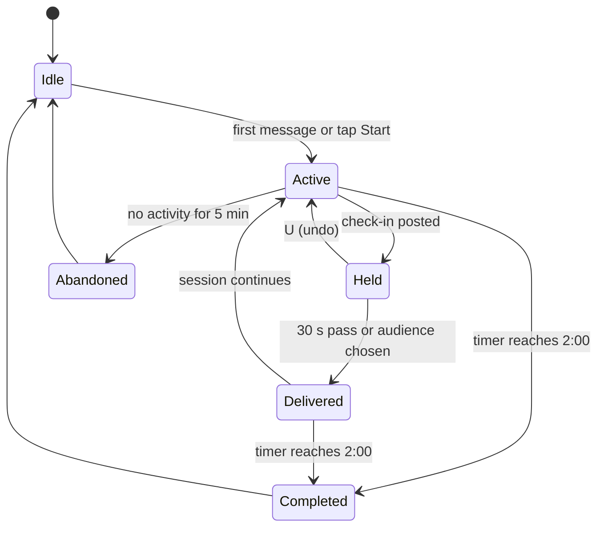
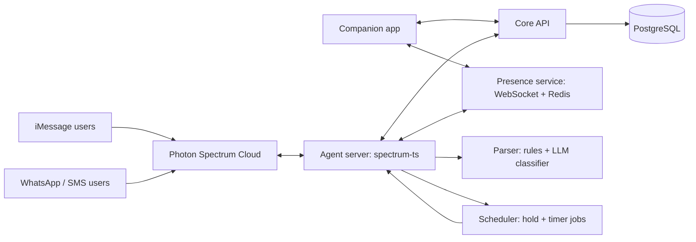

# Toothbrush Connect — Product Requirements Document

Sep 26, 2026 · @Sahmey

## Summary

Toothbrush Connect is an iMessage-first agent, built on Photon's Spectrum platform, that turns the two minutes people spend brushing their teeth into a check-in with hometown friends. Users text the agent when they start brushing, reply with one digit, emoji or tapback to share how their day or week was, and receive their friends' updates as short labelled messages. A companion app exists for people who want a visual timer, richer presence and settings, but nobody has to install it.

Users choose who sees each update: everyone in their circle, a saved list, or specific friends. The product wins if friends who had drifted apart exchange life updates at least 4 days a week, inside the messaging app they already use, with one non-dominant hand.

| Field | Value |
| --- | --- |
| Version | 2.0: iMessage-first agent via Photon, companion app, per-update recipient selection |
| Primary surface | iMessage conversation with the Toothbrush Connect agent |
| Secondary surfaces | Companion app (iOS, Android); WhatsApp and SMS for non-iMessage friends |
| Scope | MVP followed by a v1.1 iteration |
| Target MVP launch | About 12 weeks after kickoff |

## Problem and opportunity

People lose touch with hometown friends not because they stop caring, but because staying in touch needs a dedicated moment they never schedule. Texts go unanswered, calls feel like a commitment, and social feeds are built for broadcasting to hundreds, not catching up with five.

**Why existing tools fall short**

- **Messaging apps** create reply debt: an unanswered thread becomes guilt, and guilt becomes silence.
- **Social feeds** reward polished highlights, not honest "my week was stressful" updates.
- **Calls and video** need both people free, at the same time, for 20+ minutes.

**The insight: anchor to an existing habit**

Brushing teeth happens twice a day, for about 2 minutes, for nearly everyone. The time is idle, the hands are half busy, and the mind is free. Attaching a tiny social ritual to a habit people already keep removes the need to remember, schedule, or find time. This is habit stacking: the new behavior rides on a cue that already fires reliably.

**Opportunity**

- A daily, guilt-free touchpoint with the people who matter, with zero extra time cost.
- A "serendipity" mechanic (brushing at the same time as a friend) that recreates the feeling of bumping into someone back home.
- Low content-creation cost: one tap is a complete, valid update.

**Why iMessage-first**

Another app is another habit to build and another icon to forget. Living inside iMessage removes the install step, the cold-start problem and the "open the app" moment: friends can join by replying to a text, and replying with one digit is the fastest one-handed input a phone offers. The app remains for people who want more.

## Goals, non-goals and success metrics

The MVP must prove one thing: people will text an agent while brushing, often enough to keep a friend circle alive, without needing to install anything.

**Goals**

1. Make sharing a life update take under 5 seconds and one reply, with one thumb, inside iMessage.
2. Let users control who sees each update without slowing down the default path.
3. Build a twice-daily habit loop tied to brushing.
4. Create real-time "we're brushing together" moments that feel warm, not intrusive.
5. Keep one agent brain serving iMessage, WhatsApp, SMS and the companion app consistently.

**Non-goals for MVP**

- Voice or video calls during brushing.
- Public profiles, follower counts, likes or a discovery feed.
- Group-chat mode (agent added to an existing friend group chat); planned for v1.1.
- Smart toothbrush hardware integration (considered for v2).
- Photos and media attachments in check-ins.

**Success metrics**

| Metric | Definition | MVP target (day 60) |
| --- | --- | --- |
| North star: Connected days per user per week | Days a user both posted and received at least one friend update | 4.0 |
| Update rate | Sessions with a check-in posted ÷ sessions started | 80% |
| Time to post | Median time from session start to check-in posted | Under 5 s |
| Parse accuracy | Check-ins not undone or corrected ÷ check-ins posted | 97% |
| Overlap rate | Sessions with at least one friend brushing concurrently | 25% |
| Circle activation | New users with 3+ accepted friends within 7 days | 70% |
| Targeted-share rate | Check-ins sent to a list or specific friends ÷ all check-ins | Tracked, no target (learning metric) |
| D30 retention | Users active on day 30 ÷ first message to the agent | 40% |
| App attach rate | Agent users who also install the app | Tracked, no target |

**Guardrail metrics**

- Users who mute or block the agent's number stay below 5% per month.
- Undo or audience-change rate stays below 10% (higher means parsing or defaults are wrong).
- Reported "feels like pressure" in surveys stays below 10%.

## Target users and personas

The core user is a 22–35 year-old who moved away from home for school or work and has 3–8 friends they miss but rarely talk to.

| Persona | Context | Need | Main surface | What they'll use most |
| --- | --- | --- | --- | --- |
| Priya, 26, the Mover | Moved cities for a job; hometown group chat went quiet | Know what friends are up to without a long catch-up | iMessage | Short text updates, sharing some news with only her closest 3 |
| Marcus, 31, the Low-Texter | Dislikes typing; feels awkward starting conversations | Stay present without composing messages | iMessage | One-digit mood replies, tapbacks |
| Aisha, 23, the Night Owl | Grad student with irregular hours | Feel less alone at odd times | Companion app | Live overlap alerts, visual timer |
| Tom, 34, the Busy Parent | Brushes teeth alongside kids; time is scarce | A zero-effort pulse on friends | iMessage via NFC shortcut | Hands-free session start, weekly digest |
| Ravi, 28, the Android Friend | Uses Android, lives in India, friends in the US | Be part of the circle without iMessage | WhatsApp or SMS | Same labelled messages on his channel |

**Secondary audience (post-MVP):** long-distance family members and college friend groups, which follow the same small-circle pattern.

## Core concepts

These terms carry the whole product; engineering, design and copy should use them consistently.

| Term | Definition |
| --- | --- |
| Agent | The Toothbrush Connect contact users text. One agent server serves iMessage, WhatsApp, SMS and the app through Photon Spectrum providers. |
| Channel | Where a user talks to the agent: iMessage, WhatsApp, SMS, or app. Each user has one preferred channel for updates. |
| Labelled message | Every agent message starts with a bracketed label, e.g. `[😄 FUN · this week]`, so its meaning is clear at a glance. |
| Circle | A user's set of mutually accepted friends. Capped at 25 in MVP. |
| List | A saved subset of the circle (e.g., "Close 3", "High school crew"), addressable by letter or name. |
| Audience | Who receives a given check-in: Everyone, a List, or specific friends. Each user has a default audience. |
| Presence audience | Who is told "brushing now": Everyone, a List, or nobody (invisible). Follows the default audience unless changed. |
| Brush Session | A 2-minute session started by texting the agent (or tapping Start in the app). States: active, completed, abandoned. |
| Check-in | An update posted in a session: a mood (Stressful, Fun, Boring, Just okay), optional text up to 140 characters, a scope (today or this week) and an audience. |
| Delivery hold | A 30-second window after posting during which the user can change the audience or undo before any friend is notified. |
| Brush Buddy moment | Two or more friends with overlapping active sessions, within each other's presence audience. |
| Guest friend | A friend who has been invited but has never set up an account; can still reply to the agent and appear in circles. |

## Key user flows

The critical path is Flow B: one message to start, one reply to post, and no app required.

**Flow A: Onboarding by text (target under 60 seconds)**

1. A user texts the agent's number (from the website, a QR code, or a friend's invite). No download is needed.
2. The agent asks for a display name and the user's usual brushing times (morning, night, or skip).
3. The agent asks the user to share contacts to invite, by replying with names or sharing contact cards. Each invitee receives one text: `[👋 INVITE] Priya wants to catch up while brushing. Reply YES to join.`
4. Friends who reply YES are added as guest friends and can post immediately. Mutual acceptance is required before anything is shared.
5. The agent offers the companion app and an NFC or Siri shortcut for hands-free starts; both are optional.

**Flow B: Brush session in iMessage (the core loop)**

```
You:    🪥
Agent:  [⏱ STARTED] 2:00 on the clock. Here's your circle:
Agent:  [🪥 BRUSHING NOW] Sam is brushing too 👋
Agent:  [😄 FUN · this week] Aisha: "got the job!!"
Agent:  [😣 STRESSFUL · today] Marcus
Agent:  [❓ YOUR TURN] How was your day? 1 Fun · 2 Stressful · 3 Boring · 4 Just okay, or type a line
You:    2 moving apartments send help
Agent:  [✅ POSTED · STRESSFUL] Sending to Everyone (6) in 30s. W to choose who · U to undo
Agent:  [🎉 DONE] 2 minutes up. You caught up with 3 friends.
```

1. Any message ("🪥", "brushing", or a Shortcut trigger) starts a session. The agent shows the typing indicator while it gathers updates.
2. The agent sends up to 4 unseen friend updates, newest first, each as a labelled message. More are summarized in one line.
3. The agent asks for a check-in. The user replies with a digit, an emoji, a tapback on the question, or free text.
4. The check-in enters the 30-second delivery hold with the default audience. The user can reply `W` to change recipients or `U` to undo.
5. At 2:00, the agent sends `[🎉 DONE]` with a message effect.

**Flow C: Choosing who receives an update**

```
You:    1 got promoted!! @sam @aisha
Agent:  [✅ POSTED · FUN] Sending to Sam and Aisha only in 30s. U to undo

You:    2 moving apartments send help
Agent:  [✅ POSTED · STRESSFUL] Sending to Everyone (6) in 30s. W to choose who · U to undo
You:    W
Agent:  [👥 SEND TO] 1 Sam · 2 Aisha · 3 Marcus · 4 Tom · 5 Priya · 6 Jess
        Lists: A High school crew · B Close 3
        Reply with numbers or a letter, e.g. 13 or B
You:    B
Agent:  [✅ UPDATED] Sending to Close 3 (Sam, Aisha, Tom) now.
```

1. Inline: `@name` or `/listname` in the check-in sets the audience directly.
2. After posting: `W` within the hold opens a numbered picker. Numbers select friends, letters select lists, and `*` means everyone.
3. A selection made during the hold sends immediately. If the hold expires, the default audience is used.
4. Audience overrides apply to that check-in only. `default B` makes a list the new default.
5. Lists are managed by text (`new list Close 3: sam aisha tom`, `lists`) or in the app.

**Flow D: Receiving updates and Brush Buddy moments**

1. When a friend starts brushing and the user is in their presence audience, a user who is also brushing receives `[🪥 BRUSHING NOW] Sam is brushing too`.
2. A user who is not brushing receives at most one proactive overlap message per day, and none during quiet hours.
3. Friends' check-ins arrive with a label showing how personal they are: `[😄 FUN · this week]` for everyone, `[👥 CLOSE CIRCLE · FUN]` for a list or group, `[💌 JUST FOR YOU · STRESSFUL]` for one person.
4. A tapback on a friend's update is relayed to them as a reaction: `[❤️ REACTION] Aisha loved your update`.
5. Replying to an update starting with `>` sends a private reply: `[💬 REPLY] from Aisha: "call me this weekend?"`.

**Flow E: Companion app session**

1. The user taps the large Start area; the session runs with a visual timer and quadrant haptics.
2. Mood chips and the audience chip ("Everyone ▾") sit in the thumb zone. One tap posts; tapping the audience chip opens a bottom sheet of lists and friends.
3. Friends' updates show as cards above the timer. Presence updates arrive in real time over WebSockets.
4. A session started in the app is also visible to iMessage friends, and vice versa, because both use the same backend.



## Functional requirements

P0 items ship in MVP, P1 items ship in v1.1, and P2 items are candidates for later. Each requirement has a testable acceptance criterion.

**Messaging agent (FR-M)**

| ID | Requirement | Priority | Acceptance criteria |
| --- | --- | --- | --- |
| FR-M1 | Agent reachable by iMessage on a managed Photon line | P0 | Reply to any inbound message within 3 s (p95) |
| FR-M2 | Every outbound message starts with a label from the label catalog (UX section) | P0 | 100% of templates pass a label lint check in CI |
| FR-M3 | Start a session with any message when no session is active ("🪥", "brushing", Shortcut text) | P0 | Session created on first inbound message; typing indicator shown within 1 s |
| FR-M4 | Parse structured replies: digits 1–4, mood emoji, keywords, and tapbacks on the `[❓ YOUR TURN]` message | P0 | 100% accuracy on the structured grammar test suite |
| FR-M5 | Parse free text into mood, scope and a cleaned line with an LLM classifier | P0 | ≥ 95% mood accuracy on a labelled set of 500 real replies; ambiguous text asks one clarifying question |
| FR-M6 | Command grammar: `U` undo, `W` who, `END`, `STOP`, `HELP`, `lists`, `new list`, `default`, `quiet` | P0 | Commands are case-insensitive and work mid-session |
| FR-M7 | WhatsApp and SMS fallback for users without iMessage | P0 | Same flows and labels; channel chosen automatically at onboarding |
| FR-M8 | Relay tapbacks on friend updates as reactions, and `>` replies as private replies | P0 | Relayed within 5 s |
| FR-M9 | Group-chat mode: agent added to an existing friend group chat posts a nightly digest | P1 | Only members who opted in are included |
| FR-M10 | Voice-note check-ins transcribed into text | P2 | — |

**Timer and sessions (FR-T)**

| ID | Requirement | Priority | Acceptance criteria |
| --- | --- | --- | --- |
| FR-T1 | 2:00 session in iMessage: `[⏱ STARTED]` on start and `[🎉 DONE]` with a message effect at 2:00 | P0 | DONE message sent within 5 s of 2:00 |
| FR-T2 | No intermediate quadrant messages in iMessage (avoid notification spam) | P0 | Max 2 timer messages per session |
| FR-T3 | App: one-tap Start on a target covering at least the bottom 40% of the screen | P0 | Session starts within 150 ms; presence visible to friends within 2 s |
| FR-T4 | App: large countdown with quadrant haptics at 0:30, 1:00, 1:30; screen stays awake | P0 | Distinct haptic at each quadrant; no screen dimming |
| FR-T5 | End early with `END` (iMessage) or swipe-down (app) | P0 | Presence cleared within 2 s |
| FR-T6 | Configurable length (1:00–3:00) | P1 | Applies on all channels |
| FR-T7 | App: Live Activity and Android ongoing notification for the timer | P1 | Timer readable without unlocking |

**Check-ins (FR-C)**

| ID | Requirement | Priority | Acceptance criteria |
| --- | --- | --- | --- |
| FR-C1 | Four moods: Stressful, Fun, Boring, Just okay, each with a fixed digit, emoji, color and label | P0 | Same mapping on every channel |
| FR-C2 | Scope: Today (default) or This week, set with `w` suffix (e.g., `1w`) or the app toggle | P0 | Scope shown in the label |
| FR-C3 | Optional text up to 140 characters | P0 | Longer text is trimmed with a note to the sender |
| FR-C4 | Undo with `U` during the delivery hold; delete later with `delete last` | P0 | Undone check-ins are never delivered |
| FR-C5 | Edit within 10 minutes (`edit` + new text, or in app) | P0 | Recipients get `[✏️ EDITED]` only if already delivered |
| FR-C6 | One check-in per session; a second reply in the same session replaces the first while held | P0 | No duplicate deliveries |

**Audience and recipient selection (FR-R)**

| ID | Requirement | Priority | Acceptance criteria |
| --- | --- | --- | --- |
| FR-R1 | Default audience per user: Everyone or a saved List | P0 | Set at onboarding (Everyone) and changeable with `default <list>` or in app |
| FR-R2 | 30-second delivery hold after each check-in | P0 | No recipient notified before 30 s unless the user confirms an audience |
| FR-R3 | Change audience during the hold with `W` and a numbered picker (numbers = friends, letters = lists, `*` = everyone) | P0 | Picker fits in one message for circles up to 25 |
| FR-R4 | Set audience inline with `@name` or `/listname` | P0 | Fuzzy name matching; ambiguous names trigger one clarifying question |
| FR-R5 | Presence audience setting: Everyone, a List, or nobody | P0 | Brushing-now alerts only reach members of the presence audience |
| FR-R6 | Saved lists: create, rename, edit, delete by text or app; up to 10 lists per user | P0 | Lists are private to their owner |
| FR-R7 | Recipients see an audience-aware label (Everyone, Close circle, Just for you) but never the names of other recipients | P0 | Verified in label tests |
| FR-R8 | Server-side enforcement: a check-in is only readable by its recipients on every channel and API | P0 | Authorization tests cover API, timeline and digests |
| FR-R9 | App: audience chip above mood chips with a bottom-sheet picker; "Make default" option | P0 | Picker reachable with one thumb |
| FR-R10 | Suggested audience based on mood (e.g., suggest Close 3 for Stressful) | P2 | — |

**Presence and notifications (FR-P)**

| ID | Requirement | Priority | Acceptance criteria |
| --- | --- | --- | --- |
| FR-P1 | Broadcast Brushing Now to the user's presence audience (FR-R5) while a session is active, on any channel | P0 | Friends' in-app state updates within 2 s (p95) |
| FR-P2 | Brush Buddy alert when sessions overlap: in-app banner for app sessions, \[🪥 BRUSHING NOW\] message for messaging sessions | P0 | Banner and double haptic within 2 s of overlap start |
| FR-P3 | Push to friends not in the app when someone starts brushing | P0 | Messaging users: max 1 proactive overlap message per day. App users: max 1 push per friend per 30 min; max 4 presence pushes per user per day; honors quiet hours |
| FR-P4 | Per-friend notification controls (all, overlap only, mute) | P0 | Changes apply immediately |
| FR-P5 | Real-time reactions (wave, heart, laugh) during overlap; in iMessage, tapbacks map to reactions | P0 | Delivered within 1 s (p95) |
| FR-P6 | Smart reminders at the user's usual brushing times | P1 | Learned from last 14 days of sessions; at most 2 per day |
| FR-P7 | "Brush date": invite a friend to brush at the same time tonight | P2 | — |

**Circle and social (FR-S)**

| ID | Requirement | Priority | Acceptance criteria |
| --- | --- | --- | --- |
| FR-S1 | Invite friends by text: the agent sends one `[👋 INVITE]` message; YES joins as a guest friend | P0 | One invite message per invitee per 30 days; no follow-ups without a reply |
| FR-S2 | Mutual acceptance before any sharing | P0 | Pending friends receive nothing |
| FR-S3 | `circle` command lists friends with their latest mood you are allowed to see | P0 | Respects FR-R8 |
| FR-S4 | App: circle list and 14-day friend timeline, showing only check-ins the viewer received | P0 | Loads in under 1 s from cache |
| FR-S5 | Remove, block and report a friend (`remove sam`, `block sam`, or in app) | P0 | Blocked user sees no presence or check-ins |
| FR-S6 | Weekly digest on Sunday evening: circle mood mix and who you overlapped with most | P1 | One message, opt-out with `digest off` |
| FR-S7 | Visit planner: `home dec 20-28` highlights friends in town at the same time | P2 | — |

**Account and settings (FR-A)**

| ID | Requirement | Priority | Acceptance criteria |
| --- | --- | --- | --- |
| FR-A1 | Account is created by the first message; the phone number is the identity | P0 | No password; app login by phone OTP links to the same account |
| FR-A2 | Preferred channel for updates: iMessage, WhatsApp, SMS, or app | P0 | A user on several channels never receives the same update twice |
| FR-A3 | Quiet hours (default 23:00–07:00 local), set with `quiet 23-7` | P0 | No proactive messages or pushes inside quiet hours |
| FR-A4 | Go invisible (`invisible on`) | P0 | Presence hidden from everyone; posting still works |
| FR-A5 | `STOP` unsubscribes from all agent messages immediately | P0 | Complies with carrier and WhatsApp opt-out rules |
| FR-A6 | Export and delete account data (`delete my data`, or in app) | P0 | Deletion completes within 30 days; export as JSON |
| FR-A7 | App: dominant-hand setting that mirrors the layout | P0 | Applies without restart |

## One-handed UX and design principles

The phone is in the non-dominant hand, fingers may be wet, and attention is split, so every interaction must be a single short reply or a single large tap, and every action must be reversible.

**Principles**

1. **One reply is a complete action.** A digit, an emoji or a tapback posts a check-in. Everything else is optional.
2. **Labels first.** Every agent message leads with a bracketed label, so users know what it is from the notification preview alone.
3. **Fast path untouched by choice.** Recipient selection happens after posting, inside the delivery hold, so choosing who never slows down the default.
4. **Forgiving input.** Undo and audience changes are available for 30 seconds; edits for 10 minutes.
5. **Few messages.** At most 7 agent messages per session in iMessage; friend updates beyond 4 are summarized in one line.
6. **Calm by default.** No guilt copy ("You missed 3 days!"), no public counts, no streak shaming.
7. **App: thumb zone first.** All app controls live in the bottom 45% of the screen with 64×64 pt minimum targets; the top half is read-only.
8. **Haptics and effects carry meaning.** App haptics mark quadrants and overlaps; iMessage effects mark only the end of a session.

**Label catalog**

| Label | Meaning | Sent to |
| --- | --- | --- |
| \[⏱ STARTED\] | Session started, timer running | Sender |
| \[🪥 BRUSHING NOW\] | A friend in your presence audience is brushing | Friend(s) |
| \[😄 FUN · today\] / \[😣 STRESSFUL · this week\] / \[😐 BORING\] / \[🙂 JUST OKAY\] | A friend's check-in to everyone | Recipients |
| \[👥 CLOSE CIRCLE · mood\] | A check-in sent to a list or several specific friends | Recipients |
| \[💌 JUST FOR YOU · mood\] | A check-in sent to one friend | Recipient |
| \[❓ YOUR TURN\] | Prompt to check in | Sender |
| \[✅ POSTED · mood\] | Check-in accepted, delivery hold running | Sender |
| \[👥 SEND TO\] | Numbered recipient picker | Sender |
| \[✅ UPDATED\] | Audience changed | Sender |
| \[✏️ EDITED\] | A delivered check-in was edited | Recipients |
| \[❤️ REACTION\] / \[💬 REPLY\] | A friend reacted or replied privately | Author |
| \[🎉 DONE\] | Session complete, with summary | Sender |
| \[👋 INVITE\] | Invitation to join a friend's circle | Invitee |
| \[📬 DIGEST\] | Weekly recap (P1) | User |

**Reply grammar (iMessage, WhatsApp, SMS)**

| Input | Result |
| --- | --- |
| Any message with no active session | Starts a session |
| `1` `2` `3` `4` (or 😄 😣 😐 🙂) | Fun, Stressful, Boring, Just okay |
| Digit + `w` (e.g., `1w`) | Scope "this week" |
| Digit + text (e.g., `2 moving apartments`) | Mood plus a line |
| Free text only | LLM classifies mood; asks once if unsure |
| Tapback on `[❓ YOUR TURN]` | ❤️ Fun, 👎 Stressful, ❓ Boring, 👍 Just okay |
| `@sam @aisha` or `/close3` in a check-in | Sets the audience for that check-in |
| `W`, then numbers or a letter | Changes audience during the hold |
| `U` | Undo during the hold |
| Tapback on a friend's update | Relayed as a reaction |
| `>` + text | Private reply to the most recent friend update |

**Companion app screen layout (portrait)**

| Zone | Screen area | Contents | Interaction |
| --- | --- | --- | --- |
| Status zone | Top 10% | Avatars of friends brushing now | Read-only |
| Display zone | 10–55% | Countdown ring; friend check-in cards below it | Horizontal swipe between cards |
| Action zone | 55–90% | Audience chip ("Everyone ▾"), 2×2 mood chips, Today / Week toggle, "Add a line" | Tap |
| Utility zone | Bottom 10% | Reaction bar during overlap; End via swipe-down | Tap, swipe |

**Accessibility**

- Labels use words plus emoji, so VoiceOver and TalkBack read them meaningfully.
- Mood is never conveyed by color alone.
- The iMessage path works fully with Siri dictation and read-aloud.
- App: Dynamic Type up to the largest size, Reduce Motion support, and optional haptics.

## Technical architecture

One agent server built on Photon's Spectrum SDK owns all product behavior and talks to every channel through providers; the core API, PostgreSQL and the Redis presence service from v1 stay as the system of record.

Photon's Spectrum model separates concerns: the agent server owns routing, tools, memory and safety, while providers connect each interface. Its managed iMessage provider supports DMs, groups, typing indicators, reactions, threaded replies and effects; WhatsApp Business and Telegram are also supported, and custom providers can bring in apps ([Spectrum docs](https://photon.codes/docs/spectrum-ts/introduction)).



**Components**

| Component | Recommended choice | Responsibility |
| --- | --- | --- |
| Photon Spectrum Cloud | Managed iMessage lines; WhatsApp Business provider; SMS fallback | Delivery and receipt of messages, reactions, typing indicators, effects |
| Agent server | Node or Bun service using `spectrum-ts` | Conversation state machine, command grammar, labelled message templates, channel routing |
| Message parser | Deterministic rules first; small LLM classifier for free text | Mood, scope, text, audience (`@`, `/list`) extraction |
| Scheduler | Durable job queue (e.g., BullMQ on Redis, or SQS delay queues) | 30-second delivery hold, 2:00 DONE message, weekly digest |
| Core API | Stateless TypeScript service | Users, circles, lists, check-ins, audiences, settings; shared by agent and app |
| Presence service | WebSocket servers + Redis keys with TTL | Brushing-now state and overlap detection for all channels |
| Notification service | Queue worker → APNs and FCM | Pushes for app users only |
| Companion app | React Native or Flutter | Visual timer, haptics, live presence, timelines, list management |
| Primary database | PostgreSQL | Durable data |

**Session and delivery pipeline**

1. An inbound message arrives from Photon. The agent server looks up the user by phone number and channel.
2. With no active session, the agent creates one via the core API, sets presence in Redis (150 s TTL), and schedules the DONE job at 2:00.
3. The presence service checks the presence keys of friends who include this user in their presence audience; overlaps trigger `[🪥 BRUSHING NOW]` messages or app events.
4. A check-in reply is parsed, stored with status `held`, and a delivery job is scheduled for 30 s later.
5. `W` or an inline audience updates the check-in's recipients; `U` cancels the job. When the job fires (or an audience is confirmed), the check-in becomes `delivered` and is fanned out to each recipient on their preferred channel.

**Channel routing and deduplication**

- Each user has one preferred channel for friend updates; the session's channel is used for session messages.
- Fan-out writes one delivery row per recipient, keyed by check-in and recipient, so retries never double-send.
- Outbound messages per recipient are batched: several friends' updates arriving within 60 seconds are combined into one message when the recipient isn't mid-session.

**Scale assumptions for MVP**

- 100k registered users, 30k daily active, peaks around 07:00–08:00 and 22:00–23:30 local time.
- Up to 7 agent messages per session and 2 sessions per day: roughly 420k outbound messages per day at 30k DAU. Photon line count and cost must be sized against this (see Risks).
- Multi-region core services (US, EU, India) keep presence latency under 2 s.

## Data model and API

Nine durable tables in PostgreSQL cover the MVP; the new ones support channels, saved lists, per-check-in audiences and deliveries. Live presence and hold timers live in Redis.

**Tables**

| Table | Key fields | Notes |
| --- | --- | --- |
| users | id, display\_name, status (guest / active), timezone, quiet\_start, quiet\_end, invisible, default\_list\_id (null = Everyone), presence\_list\_id, preferred\_channel | Guests become active on first check-in |
| channel\_identities | id, user\_id, channel (imessage / whatsapp / sms / app), address (E.164 phone or device id), verified\_at, opted\_out\_at | Phone number is the identity across channels |
| friendships | user\_a, user\_b, status (pending / accepted / blocked), created\_at | One row per pair; user\_a < user\_b |
| friend\_lists | id, owner\_id, name, letter, created\_at | Max 10 per owner; private to owner |
| friend\_list\_members | list\_id, friend\_id | Friend must be an accepted friendship |
| brush\_sessions | id, user\_id, channel, started\_at, ended\_at, status | One active session per user |
| check\_ins | id, user\_id, session\_id, mood, scope, text (≤140), audience\_type (everyone / list / custom), list\_id, status (held / delivered / undone / deleted), deliver\_at, created\_at, edited\_at | Audience resolved to recipients at delivery |
| check\_in\_recipients | check\_in\_id, recipient\_id, channel, delivered\_at, delivery\_status | Authorization source of truth (FR-R8); idempotent fan-out |
| reactions | id, from\_user, to\_user, check\_in\_id, kind, text, created\_at | Tapbacks, waves and private replies |

**Core API (used by agent server and app)**

| Method and path | Purpose |
| --- | --- |
| POST /v1/sessions | Start a session (idempotent per user) |
| PATCH /v1/sessions/{id} | End a session |
| POST /v1/check-ins | Create a held check-in with mood, text, scope and optional audience |
| PATCH /v1/check-ins/{id}/audience | Set audience during the hold (everyone, list\_id, or friend\_ids) |
| POST /v1/check-ins/{id}/undo | Cancel during the hold |
| PATCH /v1/check-ins/{id} | Edit within 10 minutes |
| GET /v1/feed | Check-ins the caller received, newest first |
| GET /v1/circle | Friends with latest visible check-in and presence |
| GET, POST, PATCH, DELETE /v1/lists | Manage saved lists |
| PUT /v1/me/settings | Default audience, presence audience, channel, quiet hours, invisible |
| POST /v1/friends/invite | Invite by phone number (triggers agent invite message) |
| POST /v1/reactions | Reaction or private reply |

**Real-time events (presence service)**

| Direction | Event | Payload |
| --- | --- | --- |
| Client or agent → server | session.start / session.heartbeat / session.end | sessionId, userId |
| Server → app client or agent | friend.brushing\_started / friend.brushing\_ended | friendId (only if recipient is in the friend's presence audience) |
| Server → app client or agent | overlap.started | friendIds |
| Server → app client or agent | check\_in.delivered | check-in summary with audience label type |

## Privacy, safety and trust

Presence reveals when someone is home and awake, and check-ins can be personal, so both are shared only with the audience the user chose, enforced on the server, and never visible as a history to anyone else.

- **Consent before contact.** The agent only messages people who texted it first or who were invited by a friend; an invitee gets exactly one invite and nothing more without a YES.
- **Audience enforcement.** Every read path (messages, app feed, digests, API) checks `check_in_recipients`. A friend outside the audience cannot see that the check-in exists.
- **No recipient leakage.** Recipients see the audience type ("Just for you", "Close circle"), never who else received it. Lists are private to their owner.
- **Delivery hold as a safety net.** Nothing is sent to friends for 30 seconds, so mis-sends can be caught.
- **Opt-out everywhere.** `STOP` ends all agent messages immediately; `invisible on` hides presence; quiet hours block proactive messages.
- **Third-party processing.** Message content passes through Photon and, for free text, an LLM provider. Both need data processing agreements, zero data retention where available, and disclosure in the privacy policy.
- **LLM safety.** The classifier only extracts mood, scope, text and audience; it never generates messages to friends. Friend-facing text is always the user's own words.
- **No location.** The agent and app never request location.
- **Encryption.** TLS in transit; AES-256 at rest; check-in text encrypted at the column level.
- **Blocking and reporting.** `block <name>` is silent and immediate; `report` routes to a moderation queue with a 24-hour SLA.
- **Age.** Minimum 13 (16 in the EU), asked at onboarding; users under 18 default to invisible presence and cannot receive invites from unknown numbers.
- **Compliance.** TCPA and carrier rules for SMS, WhatsApp Business opt-in and template policies, GDPR and CCPA export and deletion.

## Non-functional requirements

Smoothness is the product: the agent must answer within 3 seconds and the app must reach an interactive Start in under 1.5 seconds.

| Area | Requirement |
| --- | --- |
| Agent reply latency | First reply within 3 s (p95) of an inbound message |
| Structured parse latency | Under 50 ms (rules, no LLM) |
| Free-text parse latency | Under 1.5 s (p95) including LLM call |
| Delivery hold accuracy | Check-ins delivered 30 s ± 3 s after posting |
| Presence latency | Friends notified within 3 s (p95) across channels |
| Message volume per session | At most 7 agent messages in iMessage |
| App cold start | Interactive Start in under 1.5 s on a mid-range device |
| App frame rate | 60 fps during sessions; no dropped frames in timer animation |
| Availability | 99.9% for agent server and core API; presence degrades gracefully |
| Channel failure | If Photon is unavailable, sessions still work in the app and queued messages send on recovery |
| Reliability | Zero duplicate deliveries per check-in and recipient |
| Localization | English at launch; Hindi, Spanish, Portuguese in v1.1 (labels and grammar keywords localized) |
| Platforms | iMessage on iOS, iPadOS and macOS; WhatsApp and SMS anywhere; app on iOS 16+ and Android 10+ |

## Analytics and instrumentation

Events are emitted by the agent server and app into one pipeline, tagged with channel; none carry check-in text, names or phone numbers.

| Event | Key properties | Feeds metric |
| --- | --- | --- |
| session\_started | channel, trigger (text, shortcut, nfc, app), circle\_size | Sessions per day, channel mix |
| session\_completed / session\_ended\_early | channel, duration\_s | Completion |
| check\_in\_posted | channel, mood, scope, has\_text, input\_type (digit, emoji, tapback, free\_text), ms\_since\_start | Update rate, time to post |
| check\_in\_parse\_corrected | input\_type, from\_mood, to\_mood | Parse accuracy |
| check\_in\_undone | ms\_since\_post | Guardrail |
| audience\_changed | method (inline, picker, app), audience\_type, recipients\_count | Targeted-share rate |
| check\_in\_delivered | audience\_type, recipients\_count, ms\_hold | Delivery hold accuracy |
| overlap\_started | participants\_count, channels | Overlap rate |
| reaction\_sent | kind, channel | Engagement depth |
| invite\_sent / invite\_accepted | channel | Circle activation |
| agent\_muted / stop\_received | channel | Guardrail |
| app\_installed\_by\_agent\_user | days\_since\_first\_message | App attach rate |

**Planned experiments**

- Number of friend updates shown at session start: 2 vs 4.
- Delivery hold length: 20 s vs 30 s (measure audience-change rate and perceived speed).
- Prompt copy for `[❓ YOUR TURN]`: digits listed vs emoji listed (measure time to post).

## Release plan and milestones

The iMessage agent ships first, in about 12 weeks, because it needs no app review and removes install friction; the companion app follows in v1.1. Team: 2 backend engineers, 1 mobile engineer (from week 5), 1 product designer, part-time PM.

| Phase | Weeks | Scope | Exit gate |
| --- | --- | --- | --- |
| 0. Discovery and design | 1–2 | Interviews with 15 target users; label catalog and reply grammar; Wizard-of-Oz test with a human answering as the agent | 80% of testers post in one reply under 5 s |
| 1. Agent foundations | 3–5 | Photon project and lines, agent server, core API, data model, invites, parser rules | Internal dogfood: full session over iMessage |
| 2. Core loop | 6–8 | Delivery hold, audience selection and lists, presence and overlaps, LLM free-text parsing, STOP and quiet hours | Parse accuracy ≥ 95%; zero duplicate deliveries in load test |
| 3. Closed beta | 9–11 | 30 friend circles (about 150 users), iMessage plus WhatsApp for Android friends | Update rate ≥ 70%, connected days ≥ 3 per week, mute rate < 5% |
| 4. Public MVP launch (agent) | 12 | Public number, website and QR onboarding, US and India | Photon line capacity sized for launch; on-call rota live |
| 5. v1.1 (companion app) | 13–20 | App with timer, haptics, live presence, timelines, list management; group-chat mode; weekly digest | App attach rate measured; day-60 targets met |

**Launch strategy:** growth is invite-based and happens inside messaging. Every invite is a real text from the agent that a friend can answer immediately, and launch marketing targets moments people think about home: holidays, reunions and moving season.

## Risks and open questions

The biggest new risk is platform dependency: the core experience runs on iMessage through a third party, so delivery, cost and policy changes at Photon or Apple directly affect the product.

| Risk | Likelihood | Impact | Mitigation |
| --- | --- | --- | --- |
| Photon or iMessage outage, policy change or line blocking | Medium | High | WhatsApp and SMS fallback; companion app as an independent path; keep business logic in our agent server so providers are swappable |
| Messaging cost scales with volume (about 420k messages per day at 30k DAU) | High | Medium | Cap messages per session, batch friend updates, negotiate volume pricing before launch |
| Agent feels spammy and gets muted | Medium | High | Reply-first design, 1 proactive message per day, quiet hours, STOP |
| Free-text misclassified as the wrong mood | Medium | Medium | Rules first, LLM second, confirmation label and Undo; track correction rate |
| Mis-sent personal update | Low | High | 30-second delivery hold, audience shown in the POSTED label |
| Recipient selection adds friction and lowers update rate | Medium | Medium | Selection only after posting; defaults cover most sessions; measure update rate by audience method |
| Android friends feel second-class | Medium | Medium | Identical labels and grammar on WhatsApp and SMS; companion app on Android |
| Users join alone and friends never reply | High | High | One-reply invites; guest friends can post without setting up anything |
| Novelty wears off after 2–3 weeks | High | High | Weekly digest, group-chat mode, Question of the Day (future) |

**Open questions**

- [ ] Should the default audience at onboarding be Everyone, or should users pick a list before their first check-in?
- [ ] Is 30 seconds the right delivery hold, or should it scale with audience size?
- [ ] Should guest friends (never onboarded) be able to receive "Just for you" updates?
- [ ] Should check-ins expire after 24 hours in the app timeline to match the ephemeral feel of messages?
- [ ] What is the monetization path: premium lists and themes, family plans, or oral-care partnerships?
- [ ] Should each user get a dedicated Photon line (more personal, higher cost) or share a pool of lines?

**Sources:** [Photon Spectrum documentation](https://photon.codes/docs/spectrum-ts/introduction), [Photon Spectrum overview](https://photon.codes/spectrum), [Vercel Chat SDK Photon adapter changelog](https://vercel.com/changelog/chat-sdk-adds-photon-support).
